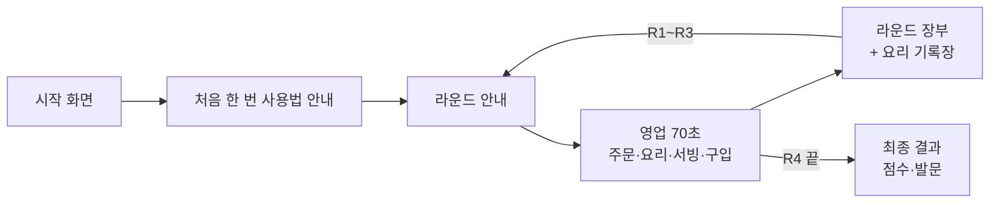

# 냥셰프의 빵집 — 게임 설계서 (v8)

거인 동물 손님이 원본 빵의 몇 배 크기를 주문하면, 학생이 재료 개수를 스스로 정해 굽고 서빙하는 5분짜리 태블릿 게임이다. 번 코인은 게임 중에 그 자리에서 바로 업그레이드에 쓴다.

구현 파일: `index.html` (같은 폴더, 단일 HTML). 이 문서가 설계의 기준이며, 바꾼 내용은 이 문서에 바로 반영한다.

## 한눈에 보기

| 항목 | 내용 |
| --- | --- |
| 대상 | 목포유달중 2학년 4개 반(반별 25~28명), 중2 「닮음」 단원 |
| 시간 | 4라운드 × 70초 = 4분 40초. 라운드 사이 장부 화면은 시간이 멈춘다 |
| 기기 | 태블릿 가로 화면, 터치(Pointer Events). 폰 가로도 들어가지만 빠듯하다 |
| 공평성 | 모든 학생에게 같은 시간(라운드당 70초)을 준다. 주문은 학생마다 무작위로 다르다 |
| 점수 | 번 코인의 합 + 참여 30. 쓴 코인은 점수에서 빠지지 않는다 |
| 파일 | index.html. 주소 끝에 `?seed=숫자`를 붙이면 같은 주문을 재현한다 |
| 학급 상황 | 평균 48점대, 중간층이 거의 없는 양극화. 하위권은 서답형을 백지로 내는 경향이 있어 첫 주문을 가장 쉽게 두고 시작 안내를 넣었다 |

## 설계 원칙

게임은 답을 알려 주지 않고, 답을 생각할 여지만 남긴다. 규칙을 설명하는 일은 선생님이 수업 시간에 맡는다.

1. **수학 표현을 화면에서 뺀다.** 「길이·넓이·부피」, 「2×2×2」, 「k²·k³」 같은 말과 식, 칸을 나눠 세어 주는 격자 힌트는 어디에도 쓰지 않는다. 말풍선에는 원본 빵과 거인 빵의 그림, 그리고 「닮음비 1 : k」만 보여 준다.
2. **재료 개수는 학생이 정한다.** 접시 모양은 넣은 재료 개수에서 저절로 만들어진다. 정답 개수를 화면이 말해 주지 않는다.
3. **틀렸을 때의 정보는 방향까지만.** 「너무 작아요/너무 커요」, 「원본과 모양이 달라요」까지만 알려 준다.
4. **규칙은 기록장으로 스스로 찾게 한다.** 성공한 주문의 닮음비와 재료 개수를 표로 쌓아 보여 주고, 마지막 화면에서 질문만 던진다.
5. **시간은 모두에게 똑같이, 주문은 학생마다 다르게.** 라운드마다 70초로 고정하고, 옆 친구 화면을 베끼기 어렵게 주문을 무작위로 뽑는다.
6. **더 빨리 해결하면 더 많이 번다.** 손님이 만족해서 떠나는 순간의 인내심이 많이 남아 있을수록 다음 손님이 빨리 온다.

## 한 판의 흐름

영업 화면에서는 시간이 흐르고, 나머지 화면에서는 멈춘다. 코인은 영업 중에만 쓰고 번다.



라운드 사이 장부 화면에는 상점이 없다. 그 라운드의 서빙 보상·빨리 서빙 보너스·콤보 보너스·감점, 보유 코인, 요리 기록장만 보여 준다.

## 화면과 조작

위쪽에 손님 3석, 아래쪽에 재료 선반 · 작업판 · 오븐이 나란히 놓인다. 잠긴 것은 화면에서 직접 눌러 연다.

| 영역 | 하는 일 | 조작 |
| --- | --- | --- |
| 손님 3석 | 말풍선에 원본 빵 → 거인 빵(칸 나누기 없는 통짜 그림)과 「닮음비 1 : k」, 아래에 인내 막대. 동물 이모지가 앉는다 | 완성품을 끌어다 놓기, 또는 빵을 탭한 뒤 손님을 탭 |
| 재료 선반(왼쪽) | 반죽 · 식빵 · 스펀지 3칸. 고르면 작업판에 빈 접시가 올라온다. 잠긴 칸은 🔒와 가격, 열린 칸은 「⬆ Lv · 가격」 버튼 | 탭 |
| 작업판(가운데) | 재료 개수에 따라 접시 모양이 자동으로 변한다. 굽기 전에는 연한 생반죽색, 굽는 동안 고양이 얼굴이 서서히 나타난다 | 봉지를 접시로 끌어다 놓기(또는 봉지 탭), 「1개 빼기」, 「비우기」 |
| 재료 봉지(작업판 아래) | 1 · 5 · 10 · 50 · 100개. 안 산 봉지는 🔒와 가격 | 끌어다 놓기 또는 탭 |
| 오븐(오른쪽) | 링이 가운데 원에 닿을 때 화면 아무 곳이나 탭. 필요한 탭 수는 오븐 등급에 따라 5 · 3 · 2번. 위에 「⬆ 오븐 업그레이드」 버튼 | 탭. 여러 손가락이 한꺼번에 닿아도 1번으로 센다 |
| 쓰레기통 | 잘못 만든 빵을 버린다(재료 낭비로 기록) | 빵을 끌어다 놓기 |

오븐에서 나온 빵은 손님에게 끌어다 놓거나, 탭으로 고른 뒤 손님을 탭해 서빙한다. 잘못 만든 빵도 서빙은 되지만 손님이 화를 낸다.

## 빵 3종과 서빙 판정

아래 규칙은 개발용이다. 화면에는 절대 표시하지 않는다. 원본은 재료 1개다.

| 빵 | 재료 | 접시 모양 | 필요한 재료 수 N | 닮은 모양 조건 |
| --- | --- | --- | --- | --- |
| 냥 바게트 | 반죽 🥖 | 반죽 마디가 한 줄로 이어짐 | k | 항상 닮음 |
| 냥 토스트 | 식빵 🍞 | 가로 칸 수 = ceil(√개수)로 채워지는 사각 접시 | k² | 정사각형이고 개수 = 가로² |
| 냥 케이크 | 스펀지 🍰 | 밑면 s×s에 층을 쌓는 상자 | k³ | 밑면 s와 층수가 같고 개수 = s³ |

토스트는 피자가 아니라 네모난 식빵이다. 피자는 원이어서 원본이 정사각형이 아니면 닮음 판정이 복잡해지기 때문이다.

서빙하면 아래 순서로 판정하고, 먼저 걸린 것에서 멈춘다.

| 순서 | 판정 | 결과 |
| --- | --- | --- |
| 1 | 주문과 다른 빵 종류 | 손님이 화냄, 인내 30% 감소 |
| 2 | 토스트·케이크인데 닮은 모양이 아님 | 인내 50% 감소, 코인 −5, 「원본과 모양이 달라요」 |
| 3 | 재료 개수가 다름 | 인내 30% 감소, 「너무 작아요/너무 커요」 |
| 4 | 굽지 않음 | 인내 30% 감소, 「안 익었어요」 |
| 5 | 정답 | 코인 지급, 손님 만족 |

틀린 빵을 받은 손님은 2.8초 동안 주문한 빵과 받은 빵을 나란히 보여 준다. 받은 빵의 개수는 보여 주되 정답 개수는 말하지 않는다.

## 손님과 주문 생성

주문은 미리 정해 둔 목록이 아니라 영업 중에 계속 생성된다. 누가 더 많은 손님을 받는지는 속도가 결정하고, 주문 난이도는 라운드와 열린 빵이 정한다.

**손님 종류.** 사자, 호랑이, 하마, 코끼리, 기린, 코뿔소, 곰 일곱 종류의 큰 동물이 무작위로 온다. 자이언트 손님은 이름 앞에 「👑 자이언트」가 붙고 이모지가 더 크며 빨간 테두리가 있다.

**주문 배율 후보.** 표의 숫자는 닮음비 k이고, 괄호 안은 그 배율이 열리는 라운드다.

| 빵 | 보통 손님 배율 (열리는 라운드) | 자이언트 배율 |
| --- | --- | --- |
| 냥 바게트 | 2, 3, 4, 5 (R1) · 6, 7 (R2부터) | 10, 12 |
| 냥 토스트 | 2, 3, 4 (R1) · 5 (R2부터) · 6 (R3부터) | 8, 10 |
| 냥 케이크 | 2 (가장 자주) · 3 · 4 (드물게) | 5 |

부피 배율이 2, 3, 4로 좁은 것은 의도다. 7³처럼 수가 애매해지는 값은 피했고, 자이언트의 큰 수(예: 케이크 1 : 5)로 「우와!」 장면을 만든다.

**주문 뽑기.** 열린 빵 중 가장 새로 열린 빵이 2배 더 자주 나온다. 바로 앞 손님과 같은 (빵, 배율)은 피한다. 게임의 첫 손님은 바게트 1 : 2 또는 1 : 3으로 고정해 하위권 학생도 쉬운 시작을 하게 한다.

**인내심(기다리는 시간).** 보통 손님은 44 + 7×√N초, 자이언트는 최대 95초(60 + 4×√N초 중 작은 값)다. N은 필요한 재료 수다. 재료가 많이 필요한 주문일수록 더 오래 기다린다.

**등장 속도.**

| 상황 | 다음 손님이 오는 시간 |
| --- | --- |
| 영업 시작 | 2초 뒤 첫 손님 |
| 손님이 왔을 때 기본 | 8~12초 뒤(빈 자리가 있을 때) |
| 손님이 만족하고 떠날 때 | 1.2 + 2.8 × (1 − 남은 인내 비율)초 뒤. 빨리 해결할수록 1.2초에 가까워진다 |
| 손님이 화내며 떠날 때 | 4초 뒤 |
| 자이언트 | R2 32초, R3 30초, R4 22초와 50초에 등장. 빈 자리가 없으면 자리가 날 때까지 기다린다 |

라운드마다 다른 점은 열린 빵이 늘고 자이언트가 오는 횟수다. R1에는 바게트 주문만 들어오고 자이언트도 없다.

## 업그레이드 (게임 중 즉석 구입)

상점 화면은 없다. 영업 중에 잠긴 칸이나 ⬆ 버튼을 누르면 코인이 빠지고 그 자리에서 바로 반영된다. 살 수 있을 때는 버튼이 초록색으로 반짝이고, 모자라면 「코인이 모자라요 (앞으로 ○○코인)」라고 알려 준다. 구입하는 동안도 영업 시간이 흐르니, 언제 무엇을 살지가 학생마다 다른 선택이 된다.

| 분류 | 항목 | 가격(코인) | 효과 | 열리는 조건 |
| --- | --- | --- | --- | --- |
| 빵 열기 | 냥 토스트 | 120 | 토스트 주문이 들어온다 | R2부터 |
| 빵 열기 | 냥 케이크 | 260 | 케이크 주문이 들어온다 | R3부터 |
| 빵 등급 | 바게트 Lv2 / Lv3 | 150 / 300 | 깨를 솔솔 뿌린 바게트 / 윤기 나는 황금 바게트 | 바게트를 열었을 때 |
| 빵 등급 | 토스트 Lv2 / Lv3 | 180 / 340 | 버터를 올린 토스트 / 딸기잼 토스트 | 토스트를 열었을 때 |
| 빵 등급 | 케이크 Lv2 / Lv3 | 220 / 400 | 딸기 케이크 / 초콜릿 케이크 | 케이크를 열었을 때 |
| 오븐 | 벽돌 오븐 | 150 | 필요한 탭 5번 → 3번, 오븐 모양이 바뀐다 | 항상 |
| 오븐 | 황금 오븐 | 320 | 필요한 탭 3번 → 2번 | 벽돌 오븐 다음 |
| 재료 봉지 | 5개 / 10개 | 50 / 110 | 한 번에 5개, 10개를 넣는다 | 항상 |
| 재료 봉지 | 50개 / 100개 | 240 / 380 | 한 번에 50개, 100개를 넣는다 | 항상 |

빵 등급이 오르면 그 빵의 보상이 Lv1의 1배, Lv2의 1.5배, Lv3의 2.2배가 된다. 가격은 모두 초안이며, 학생이 직접 해 본 뒤 조정한다.

자이언트 주문은 큰 수(케이크 1 : 5는 재료 125개)를 요구한다. 봉지를 사 두지 않으면 1개씩만 넣어야 해서 사실상 시간 안에 만들기 힘들다. 업그레이드의 필요성을 스스로 느낄 수 있도록 의도한 설계다.

## 보상과 점수

보상은 필요한 재료 수의 제곱근에 비례한다. 큰 주문이 더 벌지만 재료당 효율은 떨어지므로, 큰 주문만 노리는 전략이 무조건 유리하지 않다.

```latex
\text{보상} = 16 \times \sqrt{N} \times \text{빵 등급 배율} \times \text{완성도} \times (\text{자이언트면 } 1.5)
```

| 요소 | 규칙 |
| --- | --- |
| N | 필요한 재료 수 (바게트 k, 토스트 k², 케이크 k³) |
| 빵 등급 배율 | Lv1 ×1, Lv2 ×1.5, Lv3 ×2.2 |
| 완성도 | 오븐에서 탭한 매 박자의 정확도 평균. 박자 0.7초. 오차 0.10초 이내 100%, 0.20초 이내 70%, 그 외 40% |
| 빨리 서빙 보너스 | 위 보상 기준값 × 0.3 × (남은 인내 비율) |
| 콤보 | 연속 정답 3번마다 +20 |
| 감점 | 모양이 달라도 서빙하면 −5 |
| 점수 | 번 코인의 합 + 참여 30 (쓴 코인은 안 빠진다) |

업그레이드가 눈에 띄게 보상을 늘리는 것이 의도다. 다만 등급과 오븐을 모두 올리면 보상이 크게 불어 반 전체 순위가 업그레이드 타이밍에 좌우될 수 있어, 실제 플레이에서 분포를 봐야 한다.

## 요리 기록장과 수업 연계

기록장은 게임이 규칙을 대신 말해 주지 않고 학생이 규칙을 발견하도록 증거를 모으는 장치다. 라운드 사이 화면과 마지막 화면에 나온다.

| 닮음비 | 바게트 | 토스트 | 케이크 |
| --- | --- | --- | --- |
| 1 : 2 | (성공한 재료 개수) | ? | ? |
| 1 : 3 | (성공한 재료 개수) | ? | ? |

성공한 주문만 적히고, 아직 성공하지 못한 칸은 ?로 남는다. 표 위에 「닮음비가 커지면 재료 개수는 어떻게 달라졌나요? 빵마다 비교해 봐요!」라는 문장만 둔다.

마지막 화면의 발문은 질문 두 개다. 정답은 적지 않는다.

1. 닮음비가 2, 3, 4…로 커질 때 빵마다 재료는 몇 개씩 필요했나요?
2. 바게트, 토스트, 케이크는 왜 늘어나는 방식이 다를까요?

수업에서는 학생들이 자기 기록장을 서로 비교하게 하고, 이 두 질문을 시작으로 닮음비와 넓이·부피의 관계로 이어 갈 수 있다. 학생마다 주문이 다르기 때문에 서로 다른 닮음비를 가진 기록장을 거치면 자연스럽게 대화가 된다.

## 화면 맞추기

기기마다 화면 크기가 제각각이라, **정해진 기준 크기로 만든 화면을 통째로 줄이거나 키워서** 맞춘다. 레이아웃 자체는 건드리지 않으므로 어느 기기에서도 배치가 무너지지 않는다.

| 모드 | 기준 크기 | 언제 | 배율 예 |
| --- | --- | --- | --- |
| 기본 | 1024 × 740 | 그 밖에 전부 | 아이패드 가로 0.94, 갤럭시탭 가로 0.74 |
| 좁은화면 | 900 × 540 | 높이 480px 이하이거나 가로:세로가 1.9 이상 | 아이폰 가로 0.65 |

좁은화면에서는 머리글·오븐 칸·버튼 높이를 눌러 담은 `.compact` 규칙이 함께 켜진다. 기준 크기는 눈대중이 아니라 **레이아웃이 실제로 요구하는 높이를 재서** 정한 값이다. 칸의 내용이 늘면 이 값도 다시 재야 한다.

**기준 크기보다 크게는 키우지 않는다**(`MAX_S = 1`). 큰 모니터에서 화면이 부풀어 보기 나쁘기 때문이다. PC에서는 화면이 아무리 커도 1024×740 상자가 가운데 놓인다. three-chances의 `.game-container{max-width:1100px;margin:0 auto}`와 같은 뜻이고, 줄이는 쪽으로만 움직인다.

같이 넣은 것들:

- **고해상도 그리기.** 캔버스를 `기기 해상도 × 화면 배율`만큼 잡는다. 말풍선의 「닮음비 1 : k」가 흐려지지 않게 하려는 것이다.
- **전체화면 버튼.** 터치 기기에서만 나온다. `shared/mobile-fullscreen.js`와 같은 동작인데, 「프로토타입은 단일 HTML을 유지한다」는 규칙 때문에 파일을 불러오지 않고 같은 내용을 안에 넣었다.
- **확대 막기.** iOS는 `user-scalable=no`를 무시하므로 핀치·더블탭·길게 누르기를 직접 막는다.
- **터치 여유.** 손가락은 마우스보다 흔들린다. 탭이 드래그로 잘못 읽히는 거리를 마우스 10px, 터치 18px로 나눴다.

## 구현 상태와 조정용 상수

프로토타입 v8은 단일 HTML(JS + Canvas)로 4라운드를 끝까지 돌아간다. 봇이 4라운드를 완주하는 자동 테스트는 통과했고, 실제 태블릿에서 손으로 해 본 테스트는 아직 없다. 봇은 사람보다 훨씬 빠르므로 밸런스 판단에는 쓰지 않는다.

> 자동 테스트는 레포에 파일로 들어 있지 않다. `window.__api`로 봇을 돌리는 코드를 그때그때 써서 확인하는 방식이다. 손 테스트 절차는 같은 폴더의 `TABLET-TEST.md`에 있다.

아래 값은 모두 index.html 맨 위의 설정 구역에 있다. 조정할 때는 여기서 바꾼다.

| 이름 | 현재 값 | 뭘 정하나 |
| --- | --- | --- |
| ROUND_T | 70 | 라운드당 영업 시간(초) |
| LAST_ROUND | 4 | 라운드 수 |
| SLOTS | 3 | 동시에 앉는 손님 수 |
| BASE_R | 16 | 보상 식의 계수 |
| PAT_BONUS | 0.3 | 빨리 서빙 보너스 비율 |
| GIANT_MULT | 1.5 | 자이언트 보상 배수 |
| COMBO_BONUS / WRONG_COST | 20 / 5 | 콤보 보너스 / 모양 불일치 감점 |
| BEAT | 0.7 | 오븐 박자(초) |
| OVEN | 5 / 3 / 2탭, 가격 0 / 150 / 320 | 오븐 등급 |
| BAGS, BAGCOST | 1·5·10·50·100, 0·50·110·240·380 | 봉지 종류와 가격 |
| DISHES[].price / up / unlockR | 토스트 120, 케이크 260 · 등급 가격 · 토스트 2R, 케이크 3R | 빵 열기 가격과 열리는 라운드 |
| LVMULT | 1 / 1.5 / 2.2 | 빵 등급별 보상 배율 |
| POOL, GIANT, GIANT_AT | 앞 표와 같음 | 주문 배율 후보, 자이언트 배율과 등장 시각 |
| DESIGN, COMPACT | 1024×740 / 900×540 | 화면 맞추기의 기준 크기 |
| MAX_S | 1 | 화면을 키우는 쪽의 상한 (PC에서 부풀지 않게) |
| DRAG_SLOP | 마우스 10 / 터치 18 | 탭과 드래그를 가르는 거리(px) |

테스트용으로 페이지에 `window.__api`(구입·서빙·라운드 진행 함수들)와 `window.__S` / `window.__G`(현재 상태)가 열려 있다. 상용으로 합칠 때는 닫아도 된다.

주소 끝에 `?debug=1`을 붙이면 오른쪽 아래에 화면 크기·배율·DPR·전체화면 여부·드래그 판정 거리가 뜬다. 태블릿에서는 개발자 도구를 열 수 없어서 넣었다.

## 열린 질문과 다음 작업

아직 결정하지 않은 것들이다. 학생들이 직접 해 보고 나서 정하는 것이 많다.

- [ ] 가격·시간·보상 밸런스: 반마다 점수 분포가 너무 한쪽으로 쏠리지 않는지 확인한다
- [ ] 오븐 5번 탭이 처음에 지루하지 않은지, 박자 판정 폭(0.10초/0.20초)이 맞는지
- [ ] 자이언트의 큰 주문(케이크 125개)을 봉지 없이는 사실상 못 만드는 것이 의도대로 작동하는지
- [ ] 영업 중 구입이 시간을 쓰는 방식(구입하는 동안도 시간이 흐른다)이 학생에게 부담이 아니라 재미인지
- [ ] 부피 배율이 2, 3, 4로 좁아 케이크 주문의 다양성이 낮은 것을 받아들일지
- [ ] 하위권 학생이 첫 1분 안에 어느 정도 성공을 경험하는지
- [ ] 폰 가로에서 「닮음비 1 : k」가 읽히는지. 852×350에서 약 11px로 나온다. 안 되면 배율을 더 만지지 말고 좁은화면에서 말풍선 안의 「1 : k」만 크게 그린다

### 다음 개발 작업 (제안 순서)

1. 실제 태블릿에서 테스트: 끌어다 놓기, 봉지 탭, 오븐 탭 반응, 화면 크기 — **준비 완료, 손 테스트만 남음** (`TABLET-TEST.md`)
2. 학생 플레이 후 수치 조정(위 상수 표)
3. 포털·랭킹 연동: prism-tycoon 코드를 모범으로 shared/halomath-*.js, portal.js, Firebase 랭킹에 맞춘다. 점수는 「번 코인의 합 + 참여 30」
4. 장면형 화면: 폴더의 scene-mockup.html(요리 게임 스타일 시안)을 v8 내용에 맞게 고친 뒤 적용하고, 원본 아트로 바꾼다. 시안의 메뉴 선반에는 이전 요리 이름이 남아 있다
5. 효과음과 연출(만족한 자이언트, 업그레이드 순간)
6. 선택: 원본이 1이 아닌 주문(예: 2 : 3), 원형 피자 넓이 보너스 라운드

### 개발할 때 지킬 규칙

- 화면에 수학 용어·공식·격자 힌트를 넣지 않는다(설계 원칙 1~4).
- 모든 학생에게 같은 시간을 주는 구조를 유지한다. 무엇을 살 수 있는지는 시간이 아니라 번 코인으로만 정한다.
- 프로토타입은 단일 HTML을 유지한다. 포털에 붙일 때 파일을 나눌지는 함께 정한다.
- 바꾼 내용은 이 문서에 바로 반영한다. 판정, 보상, 등장 속도 같은 숫자가 바뀌면 해당 표를 고친다.
- 4라운드 자동 테스트(window.__api로 봇을 돌리는 방식)가 오류 없이 끝까지 가는지 매번 확인한다.
